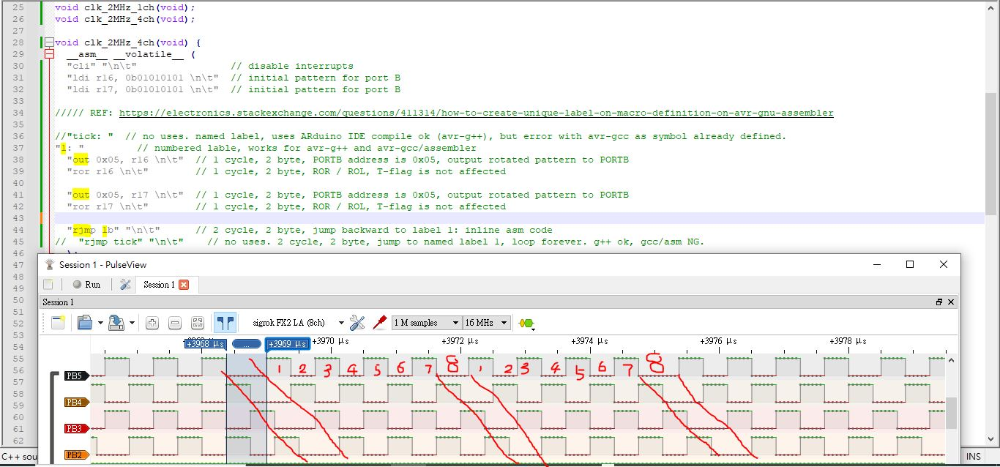

# AVR_328p_168p_8bit_rotation_prolonged_a_little-
atemga328p / 168p, why every 8bit rotation prolonged a little ? y y y ?


the code does thing likely to load "01" as bit pattern, output to PORTB, rotate 1bit, output to PORTB and loop forever.  
why every 8 bit rotation is getting stretched ?  
this is something we did not understand the avr mcu and the instructions.  

complete source code is twoMHz_square_wave.ino, either uses batch file to build hex or uses Arduino IDE to build hex, both are ok.  
rename to *.c to *.ino in case you would use Arduino IDE to compile the code.  


### assembled hex code is 100% no overhead  
```
void clk_2MHz_4ch(void) {
  __asm__ __volatile__ (          
  80:    f8 94           cli
  82:    05 e5           ldi    r16, 0x55    ; 85
  84:    15 e5           ldi    r17, 0x55    ; 85

  86:    05 b9           out    0x05, r16    ; 5
  88:    07 95           ror    r16
  8a:    15 b9           out    0x05, r17    ; 5
  8c:    17 95           ror    r17
  8e:    fb cf           rjmp    .-10         ; 0x86 <clk_2MHz_4ch+0x6>


  "rjmp 1b" "\n\t"      // 2 cycle, 2 byte, jump backward to label 1: inline asm code
//  "rjmp tick" "\n\t"    // no uses. 2 cycle, 2 byte, jump to named label tick, loop forever. g++ ok, gcc/asm NG.
  );     
```

### the PORTB signal is seeing repeated stretching, no clue to see why was that.  
  


### this is batch file to build the hex, [build.bat](build.bat)  
```
prompt xiao$G
set ac=C:\WinAVR-20100110
path %ac%\bin;%ac%\utils\bin;%path%
cls


set CHANNEL=4ch
::set CHANNEL=1ch


::set MCU=atmega328p
::set COMPORT=COM8
::set BAUD=115200

set MCU=atmega168p
set COMPORT=COM7
set BAUD=250000

set main=twoMHz_square_wave.ino

set HEX=%main%_%MCU%_%CHANNEL%.hex
set LST=%main%_%MCU%_%CHANNEL%.lst
set ASM=%main%_%MCU%_%CHANNEL%.asm
set PCB=arduino


avr-gcc.exe -dumpversion

REM compile c source file,
::-xc, compile only, no link
::-save-temps , will produce *.s, asm file also
::-msize, output instruction size to asm file
::-pipe, uses pipe, no intermediate files
avr-gcc.exe -pipe -msize -xc -Os -mmcu=%MCU% -Wall -g %main% -o %main%.out
::avr-gcc.exe -msize -save-temps -xc -Os -mmcu=%MCU% -Wall -g %main% -o %main%.out
::avr-gcc.exe -msize -save-temps -S -mmcu=%MCU% %main% -o %main%.out

REM report firmware size
avr-size.exe %main%.out

pause

::avr-gcc.exe -O2 -Wl,-Map, %1.map -o %1.out %1.c %2 %3 -mmcu=%MCU%

REM produce listing
avr-objdump.exe -h -S %main%.out > %LST%

REM produce hex file, firmware image
avr-objcopy.exe -O ihex %main%.out %HEX%

REM produce asm file of firmware image
avr-objdump -j .sec1 -d -m avr5 %HEX% > %ASM%


del %main%.out


:end

REM burn firmware to Nano
::avrdude -v -p %MCU% -c %PCB% -P %COMPORT% -b %BAUD% -D -Uflash:w:%HEX%:a


pause
```


